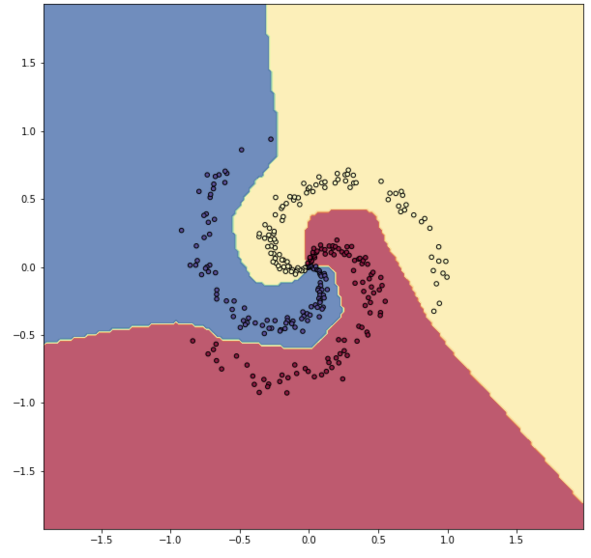

# multilayer_perceptron
A simple declarative neural net with learning rate annealing, L2 regularization, and optional Nesterov momentum optimization coded from scratch in vectorized python.
The purpose of this project was to fully understand what is happening in fully connected neural nets through implementation. The neural net was developed and tested on a generated toy dataset as well as for classification of benign or malignant growth on fine needle aspirated biopsy data from the University of Wisconsin.
Jupyter notebooks are used to visualize data and demonstrate classification with the neural net. An executable python script is also included to train and predict on the biopsy data from the command line. This method can be used to save the trained models.

<p align="center">
	
</p>

## Toy Data
A basic demonstration of classification on toy data can be seen at:

[Toy Data Demonstration Notebook](multilayer_net_demo.ipynb)

## Fine Needle Aspirated Tissue Data
A demonstration of classification of tissue data can be seen at:

[Tissue Data Demonstration Notebook](multilayer_perceptron_fine_needle.ipynb)

## Setup
`pip install -r requirements.txt`

## Usage
When using the executable the model can be trained on data:

`./MLP.py data.csv`

A `model.pkl` file will be generated.

This file can be loaded and used for prediction on a data set with:

`./MLP.py -p model.pkl data.csv`

## Neural Net API
The classifier was designed to implemented to allow networks of varying depths of layers of varying sizes to be easily instantiated and trained. A neural net object is first instantiated and then its layers are declared. The net of any size or shape can then be trained with a single method.

```python
import src.MultiLayerNet as MLN    # import the model

net = MLN.Network()                # instantiate a network object

net.add_layer('connected', 10, 100)
	# declare a fully connected layer with 10 inputs and 100 neurons

net.add_layer('ReLU', 100, 0)
	# declare a ReLU nonliniarity layer for the previous layer

net.add_layer('connected', 100, 100)
	# declare a fully connected layer with 100 inputs and 100 neurons

net.add_layer('ReLU', 100, 0)
net.add_layer('connected', 100, 2)
	# declare a fully connected output layer with two output choices

net.train(x, y, learning_rate, epochs,
	reg=l2_regularization_amount, # optional parameters
	mu=nesterov_hyperparameter,
	validate=True,                # optionally test on validation set
	validate_x=x_validation_data,
	validate_y=y_validation_data)
```

By default the final output layer passes through a softmax function to normalize the output logodds.
Each layer object in the model implements a forward, backward, and update API. This allows new layer types to be easiliy implemented and added that will function with the networks forward pass and backpropogation routines automatically.
